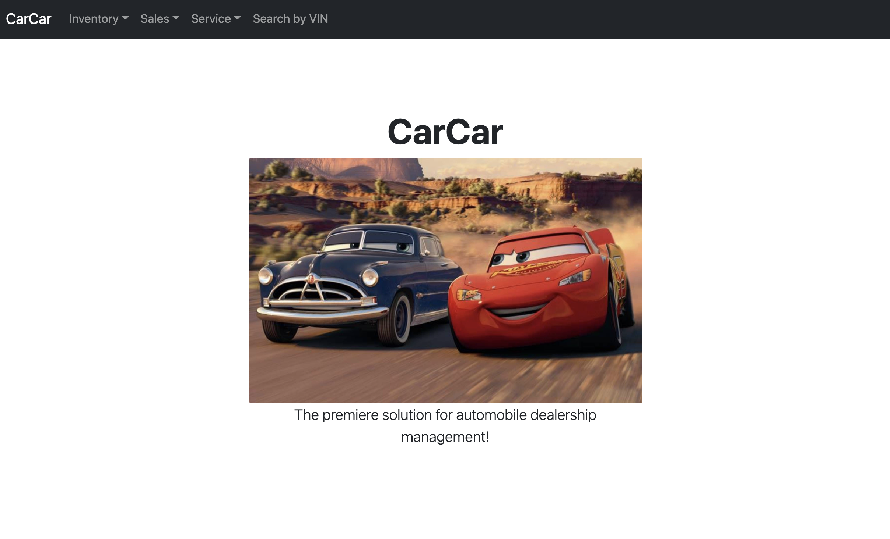
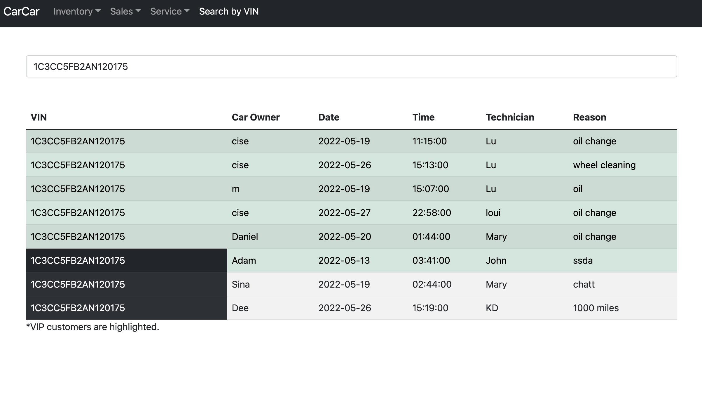
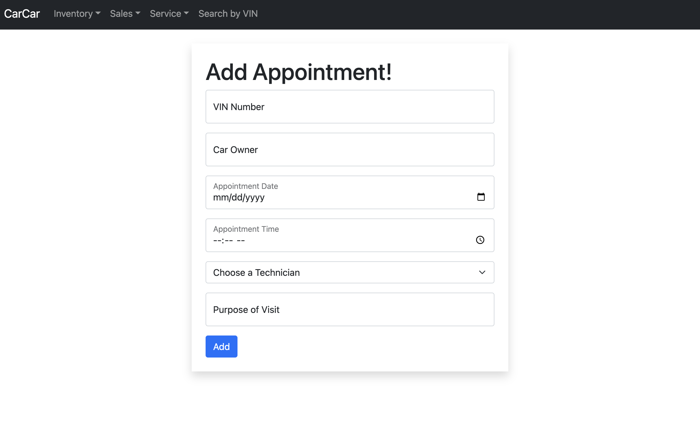
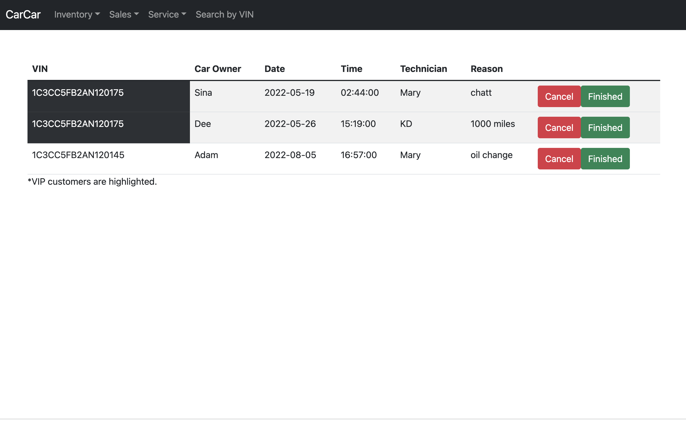

<h1 align="center">CarCar - Dealership and Service Platform 🏎</h1>

DreamTeam:

* Amanda K.- Sales
* Cise  - Service

## Design
We determined that the bounded contexts of the problem domain would align with the three main portions of our application: Automobile Inventory, Automobile Service, and Automobile Sales. We began first with building out the Inventory front-end to better understand the existing models and APIs. We determined that the Service and Sales microservices would poll the Inventory for automobile data, which is then utilized within each respective microservice. For a more detailed look at our bounded contexts and overall application design, please see the diagram below.

## Service microservice

Service microservice is handling; creating a technician, creating an appointment with a specific technician, to list the appointments filtering by as a VIP customer or appointment completed status.
 
Appointment, Technician, AutomobileVo models created. I preferred the completed/finished appointment and VIP status as a boolean property. This was, it would be reliable to change the status from the database too. For Technician create and list, for appointment create, list, detail, delete RESTful API's created. 
 
I polled the Automobile list to my microservice to compare if the VINs are matching with the created appointment VIN num and changed the VIP status.
The finished button is hiding it from the list on the front end. The cancel button is removing the appointment forever from the database. 
 
The search feature is working with an “onChange” attribute any type of change will filter the result of appointments. Completed appointments are green highlighted, black highlighted VINs are VIP customers. 
 

## Sales microservice

Explain your models and integration with the inventory
microservice, here.

For my approach to the sales microservice, I wanted to start first with creating my models, and then essentially build small pieces of functionality at a time. Sketching out a design in Excalidraw helped me visualize how I wanted to create my models and how the pieces would fit together and interact with the inventory microservice. After my models, I implemented the APIs that would allow for creation of a new Sales Person. I then designed the front-end React portion for creating a Sales Person with a form. I followed this process of getting small pieces to work, one at a time, until my microservice was complete.

For the Sales microservice, I created a model for the following, based on the requirements, and our application design: SalesPerson, Customer, SalesRecord, and AutomobileVO. I knew I wanted the AutomobileVO model to have an "is sold" status, in order to keep track of this without changing the automobile model in the inventory microservice. I created RESTful APIs for getting and creating Customers, Sales People and Sales Records, along with front-ends for them using React. 

The Sales microservice poller polls the inventory for automobile data via the automobile API. For each automobile available in the inventory, a new AutomobileVO instance is created within the Sales microservice. The automobile VIN is shared between systems. Each new AutomobileVO instance defaults to having a sold status of False upon creation. When a Sale Record is created with a specific VIN, the AutomobileVO instance is then updated to reflect being sold within the database. Only automobiles which have not yet been sold are available to select on the Sale Record creation form. The React sale record creation form fetches available AutomobileVO data via an API I created, which filters automobiles by their "is sold" status. I was really proud of getting this part to work as I intended! 

New Sales People and Customer instances are added to the database upon submission of the "Add a sales person" and "Add a potential customer" forms, respectively. This Sales Person and Customer data populates the form to create a new Sale Record, in addition to the automobile. 

Last, I created list views with React to display all of the Sales Records overall, and for sales records associated to a specific Sales Person, based on their unique employee ID. 

## Overview 

 
    <h3 align="center">Landing Page and Search VIN Page</h3>
  
   
  <h3 align="center">Create Appointment Form and Appointments List</h3>
  
     
  

## For setup

Create docker volume: \
`docker volume create beta-data`

Docker compose build: \
`docker compose build` 

Run the container: \
`docker compose up`

Access in browser:\
`http://localhost:3000`
